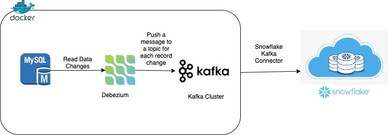

# Real-Time Data Pipeline: MySQL to Snowflake via Kafka

## Overview
This repository documents my implementation of a data pipeline using Kafka, MySQL, Debezium, and Snowflake as part of a Kafka workshop. The pipeline captures database changes from MySQL and streams them to Snowflake via Kafka.

## Architecture Diagram
The implemented solution follows this workflow:

## Key Components
 - MySQL – Source database with initial data.

 - Debezium – Captures Change Data Capture (CDC) events from MySQL.

 - Kafka Cluster – Streams change events as messages in topics.

 - Snowflake – Destination data warehouse storing processed data.

 - Kafka Connect – Manages connectors:

    - MySQL Source Connector (Debezium-based, Avro format).

    - Snowflake Sink Connector (Writes data to Snowflake tables).
## How to Reproduce
  ### Prerequisites:

  - Docker & Docker Compose.

  - Kafka cluster (local/confluent).

  - Snowflake account with configured storage.

  ### Steps:

  - Deploy MySQL and Kafka via docker-compose.yaml.

  - Load SQL scripts into MySQL.

  - Configure and deploy connectors (see /connectors/ for examples).

  - Test updates and monitor Snowflake.

## License
This implementation is provided under the MIT License.
